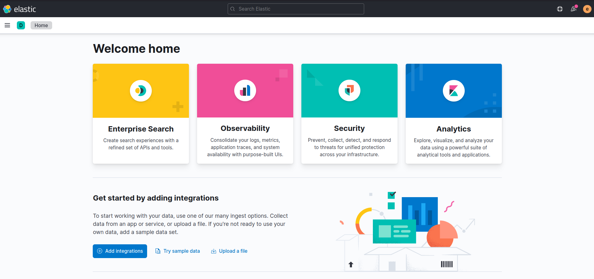

## Minimal Docker for SIEM lab (Elasticsearch, Logstash, Kibana and elastalert2)

### Introduction

Elastic Stack (ELK) Docker Composition, preconfigured with Elasticsearch, Logstash, Kibana and Elastalert. This reposiroty created for the purpose of building small SIEM Lab for collect and parse log (can be tested to create some rules).

Stack Version: `7.16.2` - Based on [Official Elastic Docker Images](https://www.docker.elastic.co/) and [Elastalert 2](https://github.com/jertel/elastalert2) 



### Requirements recommend

- [Docker 20.05 or higher](https://docs.docker.com/install/)
- [Docker-Compose 1.29 or higher](https://docs.docker.com/compose/install/)
- More than 2GB+ memory.

### How to start

Clone repo and initialize environment

```bash
$ git clone https://github.com/ctnguyenvn/mini-elk-docker
$ cd mini-elk-docker
$ bash init-lab.sh
```

Start docker-compose with background mode

```bash
$ docker-compose build
$ docker-compose up -d
```

Open web browser and visit kibana at `http://<your-server-ip>:5601` with default authentication: `elastic/changeme`

### Notes

- Kibana takes a few minutes for initialize.
- Check port open in firewall / or stop firewall in this LAB.
- Modify `.env` file for your needs, include `ELK Stack version`, `ELASTIC_PASSWORD` that setup your superuser `elastic`'s password.

By default, the stack run on version `7.16.2` with `basic` license and exposes the following ports:

- 5045/5046/5047: Logstash input
- 9200: Elasticsearch HTTP
- 9300: Elasticsearch TCP transport
- 5601: Kibana

### More

This Stack includes [elastalert2](https://github.com/jertel/elastalert2) to support a few tests to create alert rule. Currently the rule folder is set in `/elastalert2/rules/default` (run every 1 minutes) and `/elastalert2/rules/custom` (run every 5 minutes).
